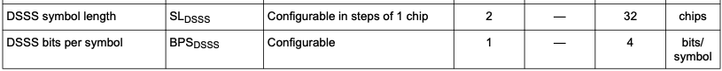
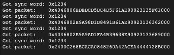
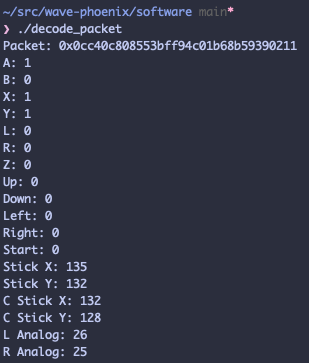

<h1 align="center">
    WavePhoenix
</h1>

    An open-source implementation of the Nintendo WaveBird protocol using Silicon Labs Wireless Gecko SoCs

    

## Motivation

The WaveBird controller is, in my opinion, one of the best controllers ever made. It is wireless, has an insane battery life, and is very comfortable to hold. The WaveBird set a new standard for wireless controllers. It was the first major console controller to use radio frequency (RF) technology, providing a reliable, lag-free connection that didn't require line-of-sight, unlike infrared controllers.

Unfortunately, Nintendo stopped producing the WaveBird more than a decade ago, causing a dwindling supply of controllers and, especially, receivers. Given the decreasing supply of receivers and the increasing resale prices, I decided to see if I could design my own from scratch.

## Firmware

The firmware for WavePhoenix is split into several components:

- [`libwavebird`](firmware/libwavebird) - implementation of the WaveBird protocol
- [`libsi`](firmware/libsi/) - implementation of the SI protocol, used by controllers to communicate with GameCube/Wii consoles
- [`receiver`](firmware/receiver) - reference implementation of firmware for a WaveBird receiver
- [`bootloader`](bootloader) - bootloader for updating application firmware via Bluetooth

## Hardware

The hardware for a reference WavePhoenix receiver is available in the [`hardware/mini-receiver`](hardware/mini-receiver) directory. The receiver is designed to be as cheap as possible and easy to build.

 

The hardware folder contains a simple PCB which hosts a [RF-BM-BG22C3](https://www.rfstariot.com/rf-bm-bg22c3-efr32bg22-bluetooth-module_p93.html) module, a pairing button, a status LED, and a JST connector for connecting to a GameCube controller port, as well as a 3D printable case.

- [`case`](hardware/mini-receiver/case) - 3D printable case for the receiver
- [`gerbers`](hardware/mini-receiver/gerbers) - Gerber files for ordering the PCB
- [`KiCad`](hardware/mini-receiver/KiCad) - KiCad project files for the PCB

Check out the [`hardware/mini-receiver/README.md`](hardware/mini-receiver/README.md) for more information on how to build your own receiver.

## Protocol

I have documented the key parts of WaveBird protocol in the headers of [`libwavebird`](firmware/libwavebird):

- [radio.h](firmware/libwavebird/include/wavebird/radio.h) - describes the radio timings and modulation
- [packet.h](firmware/libwavebird/include/wavebird/packet.h) - describes the packet format, encoding, and crc
- [message.h](firmware/libwavebird/include/wavebird/message.h) - describes the structure of the decoded packets, aka the *input state* and *origin* messages

Sam Edwards' excellent [WaveBird reversing](https://github.com/CFSworks/wavebird-reversing) documentation contain the most detailed information about the protocol, but I have tried to fill in the gaps where possible.

## Development

### Finding an SoC

In mid-2020 I began researching the WaveBird protocol and came across Sam Edwards' incredibly well-written [WaveBird reverse-engineering](https://github.com/CFSworks/wavebird-reversing) documentation. Sam's docs aren't quite perfect, but they were **essential** in getting this working, thanks, Sam!

The most challenging part of this project was finding a wireless SoC that supported the specific modulation used by the WaveBird. What Sam describes in the [line coding and framing](https://github.com/CFSworks/wavebird-reversing/tree/master/05_line_coding_and_framing#a-closer-look-at-the-wavebirds-line-code) section of his document is actually a form of DSSS (Direct Sequence Spread Spectrum), one which uses *15 chips per bit*.

DSSS is a modulation technique that spreads the signal over a wide frequency band, making it more robust to interference and noise [here's a great breakdown by GeekyMuch](https://medium.com/networks-security/dsss-direct-sequence-spread-spectrum-a31005f281cc).

While it would certainly be possible to implement 15-chip DSSS demodulation using a software-defined radio, I wanted to find an SoC that could do this in hardware *in real-time*. After reading more datasheets than I care to admit, I discovered the [Silicon Labs Wireless Gecko EFR32FG1](https://www.silabs.com/wireless/proprietary/efr32fg1-series-1-sub-ghz-2-4-ghz-socs) family of SoCs, the [datasheet](https://www.silabs.com/documents/public/data-sheets/efr32fg1-datasheet.pdf) contains the magic incantation:

Once I saw this, I had enough confidence to order a development kit and start working on the firmware.

> [!NOTE]
> Did you know that the codename for the GameCube CPU was *Gekko*? How fitting that we are using a *Gecko* SoC!

### Receiving and decoding packets

As I mentioned above, Sam's WaveBird reverse engineering documentation isn't *quite* right on a few things. Most importantly, I don't believe the DSSS chip length is accurate. After setting the DSSS chip length to 15 and configuring the many other radio settings, I got my first packet!

Decoding the packets was now simply a matter of writing some C code to de-interleave the packet, decode the [BCH(31,21)](https://en.wikipedia.org/wiki/BCH_code) messages, and perform the CRC check. After doing this, we finally had a decoded *input state* message containing the state of all the buttons and analog inputs on the controller!

But wait. Every now and then, I was getting a "corrupted" packet that somehow was still passing the CRC check. What could this be? It turns out that in addition to broadcasting *input state* messages 250 times per second, the WaveBird controller also broadcasts *origin* messages. These are sent as soon as the controller is powered on and then repeated every second after that. The origin message contains the state of the analog sticks when the console was powered on, which we'll need later.

### Communicating with a GameCube

Now we have real-time packet decoding; the next step is to send/receive commands on the *SI bus*. The SI bus is how GameCube/Wii consoles communicate with connected controllers. Jeff Longo has an insanely detailed and precise writeup about the [GameCube controller protocol](https://jefflongo.dev/posts/gc-controller-reverse-engineering-part-1/), which you should check out!

Bits are clocked in and out at speeds between 250kHz (wired OEM controllers) and 200kHz (consoles). To do this without tying up the CPU, I had to take full advantage of the peripherals on the EFR32 SoCs.

> [!NOTE]
> An OEM WaveBird receiver clocks data out at 225kHz, slightly slower than wired controllers!

#### Listen for incoming commands

The first step is to listen for the various SI commands from the console.

To read these commands, we do the following:

- Configure a `TIMER` peripheral in capture/compare mode and attach it to the SI GPIO
- Connect the `TIMER` to an `LDMA` peripheral, filling the DMA buffer with 16 "edge timings" at a time
- Listen for a "DMA full" interrupt
- Determine the length of each "low" pulse by measuring the time between pairs of edges
- Based on the length of a low pulse, we store either a `0` or a `1` in our incoming byte buffer
- The first byte identifies the SI command type; this tells us how many bits to expect in the rest of the SI transmission
- Repeat until we have a complete SI command

#### Replying to commands

Once we have a complete SI command, we need to respond (quickly!). We do this as follows:

- Use a `USART` peripheral to clock out pulses with precise timing without tying up the CPU
- Split each outgoing bit into 4 chips, so `0` becomes `0001`, `1` becomes `1110`, and stop becomes `0011`
- Configure the `USART` to output onto the SI GPIO, and set the baud rate to 1MHz (4 chips per bit @ 250kHz bitrate)
- Feed the chips into the `USART` transmit buffer, and wait for the "TX complete" interrupt to be triggered

#### Command types

The most important command is the *get input state* command, which the console requests every frame. Since we should already have the latest input state packet from the WaveBird controller, we can simply send it back to the console after converting it to the SI format.

There are a bunch of other commands that we need to respond to, such as the *info* and *get origin* commands, but I'll leave that as an exercise for the reader to discover in the code.

### Wireless ID pinning

Since the WaveBird has no true concept of pairing, it is possible for multiple WaveBird controllers to be on the same channel at the same time. This is a problem, since the receiver will receive packets from all controllers on this channel. The WaveBird uses a simple "ID pinning" mechanism to solve this problem.

An OEM WaveBird receiver will look at the 10-bit controller ID present in all packets, and "fix" the ID to the first controller it receives a packet from.

### Channel selection

As well as supporting a channel wheel just like the original WaveBird receiver, I also wanted to add one-button "virtual pairing" support. This allows you to press a button on the receiver to enter pairing mode, and then hold a combination of buttons on a controller to "pair" it with the receiver. Under the hood, this scans through all 16 potential channels looking for wireless packets, and then checks if the appropriate buttons are being held on that channel.

### A more modern SoC

Although it doesn't explicitly call this out in the datasheet, I discovered that the EFR32xG22 series of SoCs *also* support 15-chip DSSS. This is great news since they are cheaper and more modern than the EFR32xG1 series. The EFR32BG22 SoC in particular has many pre-built modules which host the SoC, crystal, antenna, and RF matching network - such as the tiny [RF-BM-BG22C3 from RF-Star](https://www.rfstariot.com/rf-bm-bg22c3-efr32bg22-bluetooth-module_p93.html)

### Tuning, tuning, tuning

The hardest part of this project *by far* was tuning the radio settings.

The original WaveBird receiver has excellent range and wireless sensitivity. It is able to receive the full 250 packets per second at a distance of 10m+, so my goal was always to match this performance.

Dropping an occasional packet here and there is not a huge problem. Most GameCube games run at 60 frames per second so we have a little bit of leeway for the occasional dropped packet. However, if we drop too many packets this will result in missed inputs.

My initial radio configuration only managed to receive around 60 packets per second, so I spent a *lot* of time tuning the settings to get better performance. I'm now measuring 230+ packets per second at distances of around 5m, which is pretty close, and I think finally good enough to release.

I still think there is *a ton* of room for improvement here, pull requests would be very welcome!

## Future ideas

- **Transmitter firmware** - `libwavebird` includes packet encoding functions, so with a little work you could "build your own" WaveBird controller!
- **N64 WaveBird receiver** - the N64 uses the same SI protocol as the GameCube, with just a slightly different input polling command, so designing a WaveBird receiver for the N64 is within reach!
- **USB HID dongle** - instead of sending input data over the SI bus, we could instead incorporate something like a [CH9329](https://www.wch-ic.com/products/CH9329.html) and send the input data over USB HID. This would allow you to use a WaveBird controller on any device that supports USB HID, such as a PC running Dolphin or RetroArch!

## Special Thanks

- [Sam Edwards](https://github.com/CFSworks) for his incredible WaveBird reverse engineering documentation, which was essential in getting this working
- [Jeff Longo](https://jefflongo.dev) - for his detailed GameCube controller protocol documentation
- [Aurelio Mannara](https://github.com/Aurelio92) - for open sourcing GC+, another great reference for the GameCube controller protocol
- [YveltalGriffin](https://bsky.app/profile/mks.bsky.social) - for help and advice along the way, and helping me figure out those mysterious origin packets
- piotref1 - for being the very first person to build a WavePhoenix receiver and provide feedback, a true early adopter!
- Everyone in the incredible [BitBuilt community](https://bitbuilt.net/) for their support and encouragement throughout this project

## License

The firmware in this repository is licensed under the [MIT License](firmware/LICENSE).

The hardware is licensed under the [Solderpad Hardware License v2.1](hardware/LICENSE).
